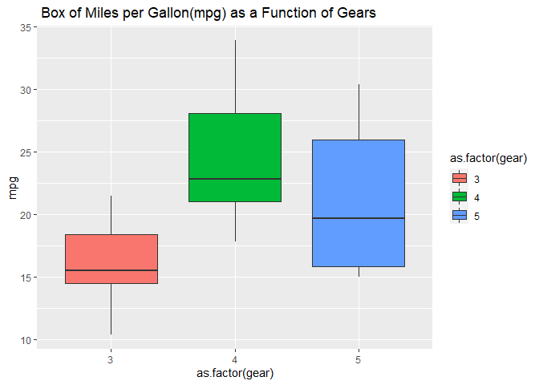
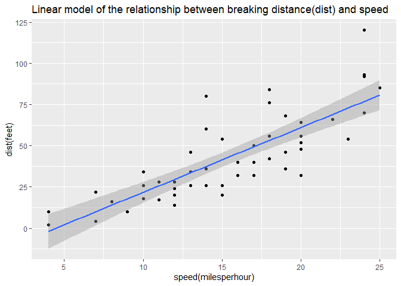
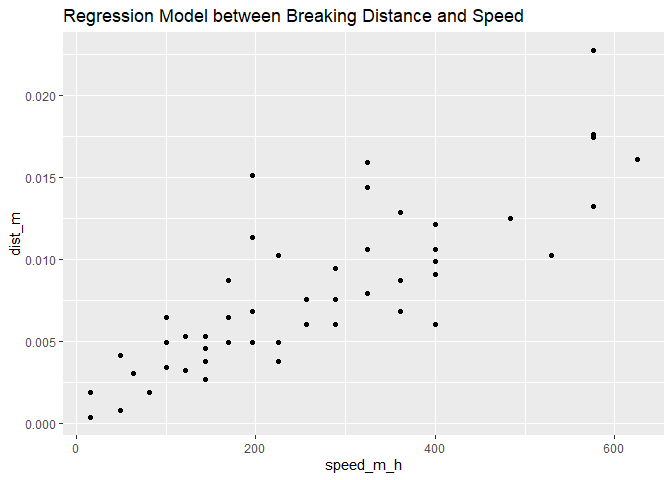

# Question 3.1. Using the sum() function and : operator, write an expression in the code snippet to evaluate the sum of all integers between 5 and 55.

\#How to use sum integers and numbers in R programming: \#There are
different ways to do so: \#I will use sum command to sum every number in
the range 5-&gt;55. The answer is 1530 \#sum(5:55)

    sum(5:55)

    ## [1] 1530

\#We can also find the sum from a few numbers, which determined between
5 and 55
sum(5,6,7,8,9,10,11,12,13,14,15,16,17,18,19,20,21,22,23,24,25,26,27,28,29,30,31,32,33,34,35,36,37,38,39,40,41,42,43,44,45,46,47,48,49,50,51,52,53,54,55)

    sum(5,6,7,8,9,10,11,12,13,14,15,16,17,18,19,20,21,22,23,24,25,26,27,28,29,30,31,32,33,34,35,36,37,38,39,40,41,42,43,44,45,46,47,48,49,50,51,52,53,54,55)

    ## [1] 1530

\#We can generate a sequence of numbers either named \#(specified) using
from, by, and to: \#seq(5,55,1)

    seq(5,55,1)

    ##  [1]  5  6  7  8  9 10 11 12 13 14 15 16 17 18 19 20 21 22 23 24 25 26 27 28 29
    ## [26] 30 31 32 33 34 35 36 37 38 39 40 41 42 43 44 45 46 47 48 49 50 51 52 53 54
    ## [51] 55

\#or unnamed (not specified) using: \#seq(by=1, from=5, to=55)

    seq(by=1, from=5, to=55)

    ##  [1]  5  6  7  8  9 10 11 12 13 14 15 16 17 18 19 20 21 22 23 24 25 26 27 28 29
    ## [26] 30 31 32 33 34 35 36 37 38 39 40 41 42 43 44 45 46 47 48 49 50 51 52 53 54
    ## [51] 55

\#Since the vector is an ordered list of numbers, we have to use the
command \#sum x &lt;- c(5:55);sum(x)

    sum(x <- c(5:55))

    ## [1] 1530

# Question 3.2. Write a function called sumfun with one input parameter, called n, that calculates the sum of all integers between 5 and n. Use the function to do the calculation for n = 10, n = 20, and n = 100 and present the results.

    sumfun <- function(n) {sum(5:n)}

    sumfun(10)

    ## [1] 45

    sumfun(20)

    ## [1] 200

    sumfun(100)

    ## [1] 5040

# Question 3.3. The famous Fibonacci series is calculated as the sum of the two preceding members of the sequence, where the first two steps in the sequence are 1, 1. Write an R script using a for loop to calculate and print out the first 12 entries of the Fibonacci series.

\#to calculate the Fibonacci series with n values: \#fib &lt;-
function(n) \#or fib &lt;-numeric(n)

    fib <-numeric(12)

\#fib of the first number is 1 \#fib\[1\] &lt;- 1

    fib[1] <- 1

\#fib of the second number is 2 \#fib\[2\] &lt;- 1

    fib[2] <- 1

\#the loop starts from the third number; that means: \#i = 3

    i = 3

\#we have to repeat the loop to the 12th number of fib

    fib <- function(n) {  # function for calculating fibonnaci of a vector with n values
       fib <-numeric(n)
       fib[1] <- 1 
       # fib of the first number is 1
       fib[2] <- 1 
       # fib of the second number is 2
       i = 3 
       # start the loop at the third element
       
       while (i <= n) { # repeat the loop for the 12th  number of fib
       fib[i]=fib[i - 1] + fib[i - 2]
       i<- i + 1
      }
      return(fib) # return the modified vector
     }
     fib(12)

    ##  [1]   1   1   2   3   5   8  13  21  34  55  89 144

# Question 3.4. With the mtcars dataset bundled with R, use ggplot to generate a box of miles per gallon (in the variable mpg) as a function of the number of gears (in the variable gear). Use the fill aesthetic to colour bars by number of gears.

    str(mtcars)

    ## 'data.frame':    32 obs. of  11 variables:
    ##  $ mpg : num  21 21 22.8 21.4 18.7 18.1 14.3 24.4 22.8 19.2 ...
    ##  $ cyl : num  6 6 4 6 8 6 8 4 4 6 ...
    ##  $ disp: num  160 160 108 258 360 ...
    ##  $ hp  : num  110 110 93 110 175 105 245 62 95 123 ...
    ##  $ drat: num  3.9 3.9 3.85 3.08 3.15 2.76 3.21 3.69 3.92 3.92 ...
    ##  $ wt  : num  2.62 2.88 2.32 3.21 3.44 ...
    ##  $ qsec: num  16.5 17 18.6 19.4 17 ...
    ##  $ vs  : num  0 0 1 1 0 1 0 1 1 1 ...
    ##  $ am  : num  1 1 1 0 0 0 0 0 0 0 ...
    ##  $ gear: num  4 4 4 3 3 3 3 4 4 4 ...
    ##  $ carb: num  4 4 1 1 2 1 4 2 2 4 ...

    library(ggplot2)

    ## Warning: package 'ggplot2' was built under R version 4.0.5

    ggplot(data = mtcars, aes(x= as.factor(gear), y= mpg)) + geom_boxplot(aes(fill= as.factor(gear) )) + ggtitle(" Box of Miles per Gallon(mpg) as a Function of Gears")

# Question 3.5. Using the cars dataset and the function lm, fit a linear relationship between speed and breaking distance in the variable distance. What are the fitted slope and intercept of the line, and their standard errors? What are the units used for the variables in the dataset?

\#First, we have to set variable for x and y axises. \#then, we can set
linear model formula and get the summary of model

    y <- cars $dist; x <- cars $speed; 
    model <- lm(formula = "y ~ x")
    summary(model)

    ## 
    ## Call:
    ## lm(formula = "y ~ x")
    ## 
    ## Residuals:
    ##     Min      1Q  Median      3Q     Max 
    ## -29.069  -9.525  -2.272   9.215  43.201 
    ## 
    ## Coefficients:
    ##             Estimate Std. Error t value Pr(>|t|)    
    ## (Intercept) -17.5791     6.7584  -2.601   0.0123 *  
    ## x             3.9324     0.4155   9.464 1.49e-12 ***
    ## ---
    ## Signif. codes:  0 '***' 0.001 '**' 0.01 '*' 0.05 '.' 0.1 ' ' 1
    ## 
    ## Residual standard error: 15.38 on 48 degrees of freedom
    ## Multiple R-squared:  0.6511, Adjusted R-squared:  0.6438 
    ## F-statistic: 89.57 on 1 and 48 DF,  p-value: 1.49e-12

\#To answer these questions from the coefficient dataset provided above,
we can determine: \#The fitted slope is 3.9324 \#The intercept of the
line is -17.5791 \#Their standard errors are 6.7584 (for intercept
(dist)) \#and 0.4155 (for X (speed)) \#The units used for the variables
in the dataset to \#measure the speed and breaking distance is feet

# Question 3.6. Use ggplot to plot the data points from Task 6 and the linear fit.

\#we have to download: library(ggplot2) to help us run the plots

    library(ggplot2)

\#we have to identify the variables to run the plots

    qplot(speed, dist, data = cars, geom ="point")

    qplot(speed, dist, data = cars, geom ="point") + geom_smooth(method= "lm", se = FALSE)

    ## `geom_smooth()` using formula 'y ~ x'

\#we have to create new variables named ggplot\_new and add a title, x,
and y lables it to the previous plot

    ggplot <- ggplot(data = cars, aes(x= speed, y=dist)) + geom_point() + geom_smooth(method = "lm",formula = "y ~ x")

    ggplot_new <- ggplot + ggtitle ("Linear model of the relationship between breaking distance(dist) and speed")+ xlab("speed(milesperhour)")+ ylab("dist(feet)")
    ggplot_new

    ggplot_new

# Question 3.7. Again using the cars dataset, now use linear regression (lm) to estimate the average reaction time for the driver to start breaking (in seconds). To simplify matters you may assume that once breaking commences, breaking distance is proportional to the square of the speed. Explain the steps in your analysis. Do you get reasonable results? Finally, use ggplot to plot the data points and the fitted relationship.

    model$residuals

    ##          1          2          3          4          5          6          7 
    ##   3.849460  11.849460  -5.947766  12.052234   2.119825  -7.812584  -3.744993 
    ##          8          9         10         11         12         13         14 
    ##   4.255007  12.255007  -8.677401   2.322599 -15.609810  -9.609810  -5.609810 
    ##         15         16         17         18         19         20         21 
    ##  -1.609810  -7.542219   0.457781   0.457781  12.457781 -11.474628  -1.474628 
    ##         22         23         24         25         26         27         28 
    ##  22.525372  42.525372 -21.407036 -15.407036  12.592964 -13.339445  -5.339445 
    ##         29         30         31         32         33         34         35 
    ## -17.271854  -9.271854   0.728146 -11.204263   2.795737  22.795737  30.795737 
    ##         36         37         38         39         40         41         42 
    ## -21.136672 -11.136672  10.863328 -29.069080 -13.069080  -9.069080  -5.069080 
    ##         43         44         45         46         47         48         49 
    ##   2.930920  -2.933898 -18.866307  -6.798715  15.201285  16.201285  43.201285 
    ##         50 
    ##   4.268876

    View <- lm(dist ~ speed, data = cars)

    model <- lm(dist ~ speed, data = cars)

    summary(model)

    ## 
    ## Call:
    ## lm(formula = dist ~ speed, data = cars)
    ## 
    ## Residuals:
    ##     Min      1Q  Median      3Q     Max 
    ## -29.069  -9.525  -2.272   9.215  43.201 
    ## 
    ## Coefficients:
    ##             Estimate Std. Error t value Pr(>|t|)    
    ## (Intercept) -17.5791     6.7584  -2.601   0.0123 *  
    ## speed         3.9324     0.4155   9.464 1.49e-12 ***
    ## ---
    ## Signif. codes:  0 '***' 0.001 '**' 0.01 '*' 0.05 '.' 0.1 ' ' 1
    ## 
    ## Residual standard error: 15.38 on 48 degrees of freedom
    ## Multiple R-squared:  0.6511, Adjusted R-squared:  0.6438 
    ## F-statistic: 89.57 on 1 and 48 DF,  p-value: 1.49e-12

    cars$residuals <- model$residuals

    View(cars)

    cars$spridicted <- model$fitted.values

    predict(model, data.frame(speed = c(12.5, 15.5, 17)))

    ##        1        2        3 
    ## 31.57601 43.37324 49.27185

    predict(model, data.frame(speed = c(12, 15, 18)))

    ##        1        2        3 
    ## 29.60981 41.40704 53.20426

    ggplot <- ggplot(data = cars, aes(x= speed, y=dist)) + geom_point() + geom_smooth(method = "lm",formula = "y ~ x")
    ggplot_new

\#First: we have to idenify the variables: \#breaking distance in miles
= dist\_m \#one foot in miles = 0.000189394 \#we have convert distance
to miles \#dist\_m &lt;- cars$dist\*0.00018939 \#Second: we have to
idenify the variables: \#speed in miles per hour = speed\_m\_h \#the
breaking distance is propotional to square of \#the speed: speed\_m\_h
&lt;- cars $speed^2 \#Now ready for the formula of linear model (lm):
\#lm(formula = dist\_m ~ speed\_m\_h)

    dist_m <- cars$dist*0.000189394

    speed_m_h <- cars $speed^2

    lm(formula = dist_m ~ speed_m_h)

    ## 
    ## Call:
    ## lm(formula = dist_m ~ speed_m_h)
    ## 
    ## Coefficients:
    ## (Intercept)    speed_m_h  
    ##   1.678e-03    2.443e-05

\#since the distance and speed are constant and the \#slope means half
the reaction time, we have to \#convert the reaction time in one hour to
seconds: \#1*60*60 = 3600 seconds \#reaction\_time &lt;- 2.443e-05\*2
\#the slope reaction time is twice or double the \#reaction time

    reaction_time <- 2.443e-05*2

    coverted_reaction_time <- reaction_time/3600

    coverted_reaction_time

    ## [1] 1.357222e-08

\#the results are not significant for the reaction \#time and they are
negative for the reaction time. \#the results expected to be
proportional and double \#the value of the slope reaction\_time

    library(ggplot2)

    plot_1 <- ggplot(data = cars, aes(speed_m_h, dist_m))+geom_point()

    plot_2 <- plot_1 + geom_smooth(method = "lm", formula = dist_m ~ speed_m_h)

    plot_3 <- plot_2 + ggtitle("Regression Model between Breaking Distance and Speed")

    plot_3

    ## Warning: 'newdata' had 80 rows but variables found have 50 rows

    ## Warning: Computation failed in `stat_smooth()`:
    ## arguments imply differing number of rows: 80, 50

